# 🚀 LangGraph: Building Stateful AI Agents as Graphs  

**Official Links**  
- [GitHub Repository](https://github.com/langchain-ai/langgraph)  
- [Documentation](https://langchain-ai.github.io/langgraph/)  
- [LangChain Academy Course](https://github.com/gayashan4lk/langchain-academy-lang-graph-intro) (Free Intro)  
- [Prebuilt Agents & Templates](https://langchain-ai.github.io/langgraph/concepts/template_applications/)  

---

## 📌 Overview  
LangGraph is a Python library for creating **stateful, multi-step AI workflows** using Large Language Models (LLMs). It enables dynamic decision-making through graph-based architectures, allowing developers to design agents that loop, branch, and interact with tools/APIs. Inspired by Pregel and Apache Beam, it’s widely used by companies like LinkedIn, Uber, and Elastic.  

---

## 🔑 Key Features  
1. **Graph-Based Workflows**  
   - Define workflows as **nodes** (tasks) and **edges** (connections).  
   - Supports **conditional edges** (e.g., "If tool call needed, route to tools node").  

2. **State Management**  
   - Persist conversation history, tool outputs, or custom data across interactions using checkpoints.  

3. **Multi-Actor Support**  
   - Build collaborative agents (e.g., one agent retrieves data, another generates responses).  

4. **Prebuilt Agents**  
   - Use templates like `create_react_agent` for ReAct-style agents or customize workflows.  

5. **LangGraph Platform** (Commercial)  
   - Deploy agents at scale with streaming, background runs, and monitoring.  

---

## 🛠️ Getting Started  

### Installation  
```bash
pip install -U langgraph  # Core library 
pip install langchain_groq streamlit  # For Groq models and Streamlit UI
```

### Basic Example: ReAct Agent  
```python
from langgraph.prebuilt import create_react_agent
from langchain_groq import ChatGroq  # Changed import
import os

# Define a search tool (remains the same)
@tool
def search(query: str):
    if "san francisco" in query.lower():
        return "60°F, foggy"
    return "90°F, sunny"

# Initialize agent with Groq
model = ChatGroq(
    temperature=0,
    model_name="mixtral-8x7b-32768"  # Groq model name
)
checkpointer = MemorySaver()  # Persists state
app = create_react_agent(model, [search], checkpointer=checkpointer)

# Invoke with thread_id for state retention (same)
response = app.invoke(
    {"messages": [{"role": "user", "content": "Weather in SF?"}]},
    config={"configurable": {"thread_id": 42}}
)
print(response["messages"][-1].content)  # Outputs weather details
```

Key:  
1. Uses `langchain_groq.ChatGroq`  
2. Specifies Groq model name (`mixtral-8x7b-32768` or `llama2-70b-4096`)  
3. Requires `GROQ_API_KEY` environment variable  

Set your API key:  
```python
os.environ["GROQ_API_KEY"] = "your-key-here"
```

---

## 🚀 Running the Streamlit App  

This project includes a Streamlit-based web interface for interacting with the Groq ReAct Agent. Follow the steps below to set up and run the app.  

### Prerequisites  
1. **Python 3.8+**: Ensure Python is installed on your system.  
2. **Groq API Key**: Obtain your API key from the [Groq Cloud Console](https://console.groq.com/).  

### Steps to Run  
1. Clone the repository:  
   ```bash
   git clone https://github.com/aitiwari/langgraph.git
   cd langgraph
   ```

2. Install the required dependencies:  
   ```bash
   pip install -r requirements.txt
   ```

3. Set your Groq API key as an environment variable:  
   ```bash
   export GROQ_API_KEY="your-api-key-here"
   ```

4. Start the Streamlit app:  
   ```bash
   streamlit run app.py
   ```

5. Open your browser and navigate to the URL provided in the terminal (usually `http://localhost:8501`).  

### Using the App  
- **Input Field**: Type your question or query in the chat input box at the bottom of the screen.  
- **Chat History**: The conversation history will be displayed above the input field.  
- **API Key**: If you didn't set the `GROQ_API_KEY` environment variable, you'll be prompted to enter it in the app.  

### Example Queries  
- "What's the weather in San Francisco?"  
- "Tell me about the weather in New York."  

### Stopping the App  
To stop the Streamlit app, press `Ctrl+C` in the terminal where the app is running.  

---

## 🌟 Use Cases  

### 1. Basic Chatbot  
**Prompt**: What is generative AI?  
**Reference**:  
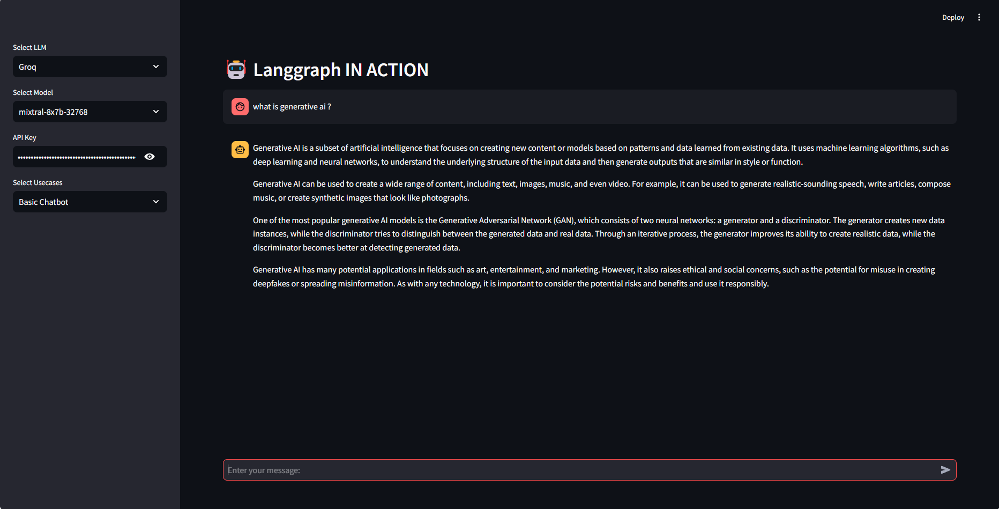 
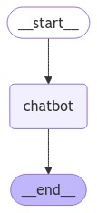 
 

### 2. Chatbot with Tool
**Prompt**: Latest news from the India vs Australia match?  
**Prompt2**: search latest news from india  
**Reference**:  
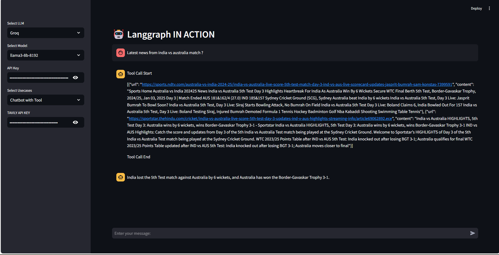 
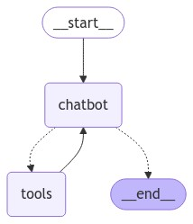  

### 3. Appointment Receptionist  
**Prompt 1**: Book an appointment for priti.  
**Prompt 2**: Yes or No.  
**Reference**:  
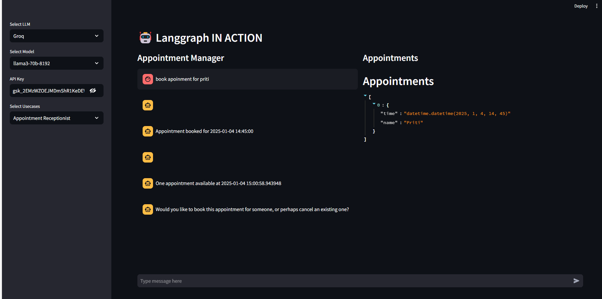 
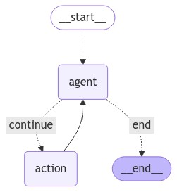  


### 4. Customer Support  
**Reference**:  
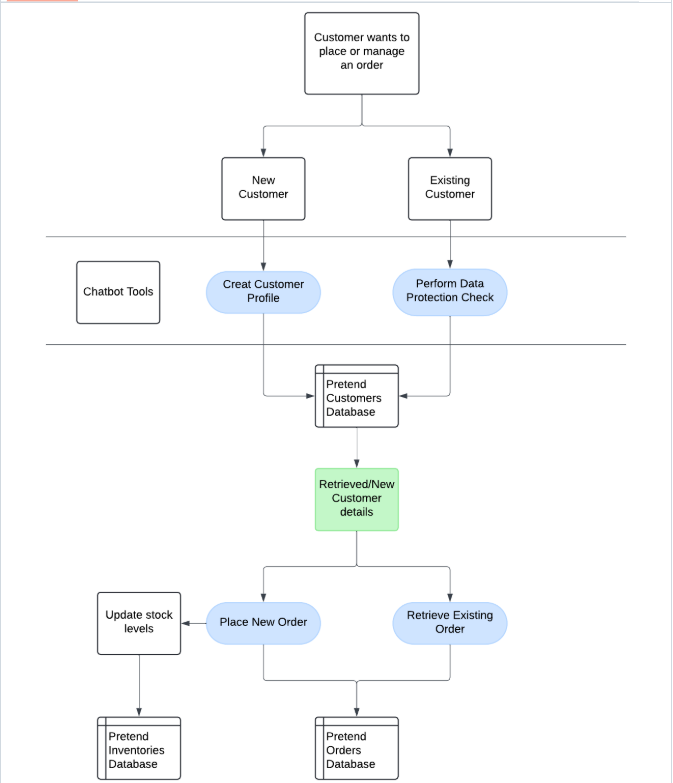  
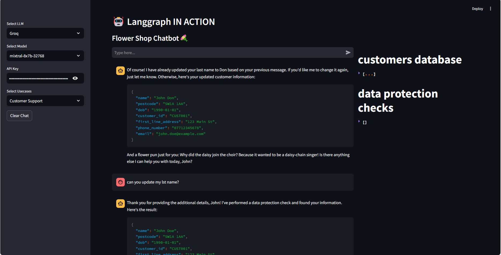  

### 5. Travel Planner 
**Reference**:  
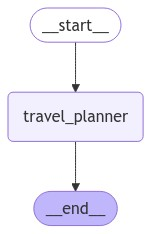  
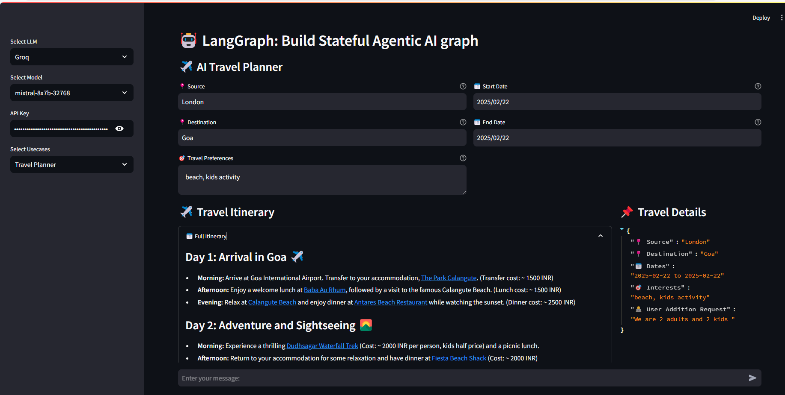  

### 6. Travel Planner 
**Reference**:  
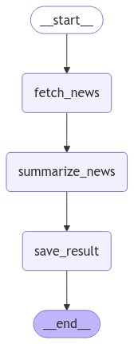  
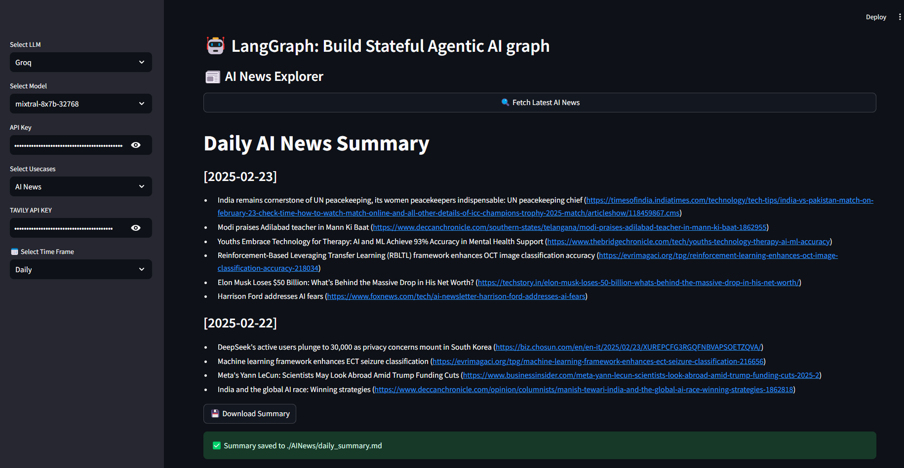  

---

## 📚 Templates & Community  
Explore prebuilt templates for chatbots, retrieval agents, and more:  
```bash
langgraph new  # CLI to create apps from templates 
```  
| Template          | Description                          | Link                                   |  
|-------------------|--------------------------------------|----------------------------------------|  
| ReAct Agent       | Tool-calling agent with memory       | [GitHub](https://github.com/langchain-ai/langgraph/tree/main/examples) |  
| Retrieval Agent   | RAG with dynamic context fetching    | [Docs](https://langchain-ai.github.io/langgraph/concepts/template_applications/) |  

---

## 📖 References  
1. [Official Documentation](https://langchain-ai.github.io/langgraph/)  
2. [GitHub Examples](https://github.com/langchain-ai/langgraph/tree/main/examples)  
3. [Agentic RAG Guide](https://medium.com/@wendell_89912/building-an-agentic-rag-with-langgraph-a-step-by-step-guide-009c5f0cce0a)  
4. [Production Case Studies](https://blog.langchain.dev/top-5-langgraph-agents-in-production-2024/)  

---

For advanced use cases (multi-agent systems, human-in-the-loop), refer to the [LangGraph Platform](https://www.langchain.com/langgraph) or explore the [LangChain Academy](https://github.com/gayashan4lk/langchain-academy-lang-graph-intro).  

--- 

This version integrates the Streamlit app instructions seamlessly into the existing structure while maintaining the original tone and style.